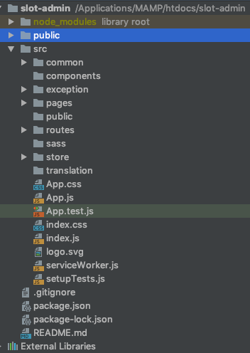

# tam-admin

`src->common`
A directory to group all helpers function and keys (middleware, validator, helpers, public key).

`src->components`
A directory to group all components.

`src->exception`
A directory to put exception materials handling 404.

`src->pages`
A directory to keep all pages design.

`src->public`
A directory to keep all assets.

`src->routes`
A directory to keep all pages routes.

`src->sass`
A directory to keep all css/scss.

`src->store`
A directory to keep all redux config (actions, reducer, store).

`src->translate`
A directory to keep all translation files.
